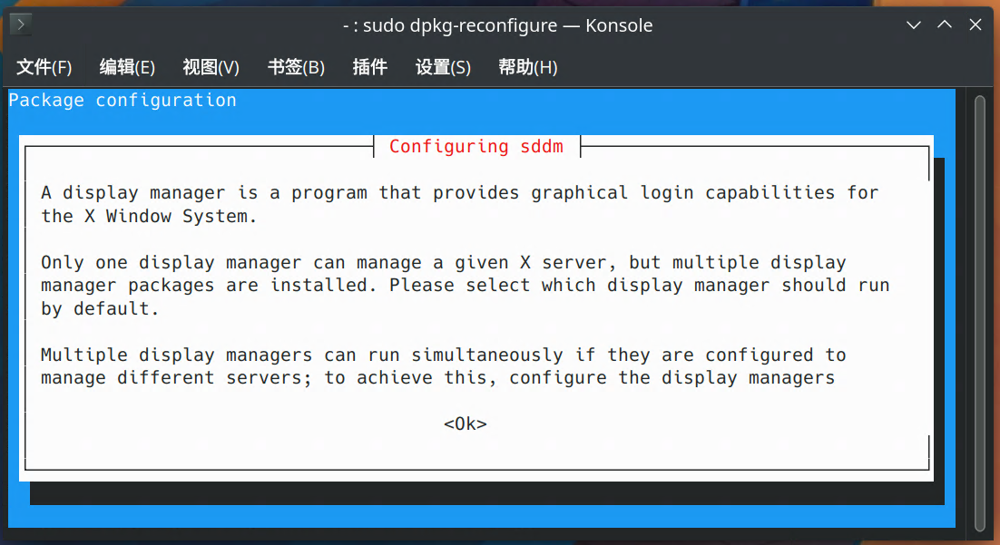

# Linux 常用软件的安装与设置笔记集

## ubuntu 安装 kde 桌面并使 rdp 连接 / hyper-v 增强会话模式 登录进入 kde 桌面

### 安装 kde

```bash
sudo apt install kubuntu-desktop
```

（由于已经安装了 `kde` ，因此此处的窗口都是用的 `kde` 终端打开，和用 `gnome` 桌面的终端打开的结果有一些ui上的不同，如背景颜色）

等待安装时应该会弹出窗口，形如



此处只是告诉你这个设置是要做什么，确认即可，接下来是另一个窗口，形如


这里是指示选择要使用的 `display manager`，为了能默认进入 `kde` 界面，建议是使用新安装的 `sddm` 作为 `display manager`。用上下键让光标选中 `sddm`，然后回车确定即可，再之后重启即可生效

如果需要重新设置 `display manager`，则需要使用

```bash
sudo dpkg-reconfigure sddm
```

重新设置为 `gdm3`

如果本来 `display manager` 就是 `gdm3` ， 则需要使用

```bash
sudo dpkg-reconfigure gdm3
```

进入上面两个窗口，重新设置

### 使 rdp 连接 / hyper-v 增强会话模式 登录进入 kde 桌面

确认了 物理机启动 / `hyper-v` 标准会话模式下是能进入 `kde` 桌面的情况下，输入

```bash
echo "/usr/bin/startplasma-x11" > ~/.xsession
```

然后重启系统重新连接即可

---
## pip 包管理器安装与更新

### 下载安装脚本

```bash
wget https://bootstrap.pypa.io/get-pip.py
```

### 使用 python 运行

```bash
python3 ./get-pip.py
```

### 添加环境变量

将 `~/.local/bin` 添加到环境变量 （以下以 fish 为例）

在 `~/.config/fish/config.fish` 添加

```bash
set -x PATH ~/.local/bin $PATH
```

或（输入一次指令，持久有效）

```bash
fish_add_path ~/.local/bin
```

### 更新 / 安装 pip 及其他包

* 更新：（以 `pip` 为例）

    ```bash
    python3 -m pip install --upgrade pip
    ```

* 同理，`pip` 的安装指令为

    ```bash
    python3 -m pip install <pack_name>
    ```

如果已将 `pip` 添加到环境变量，则 `python3 -m pip` 可以直接替换为 `pip` ，即

* 更新：（以 `pip` 为例）

    ```bash
    pip install --upgrade pip
    ```

* `pip` 的安装指令为

    ```bash
    pip install <pack_name>
    ```

---

## 安装 fcitx5 及中文输入法 rime配置

### 安装中文语言包

```bash
sudo apt-get install language-pack-zh-hans
```

### 安装 fcitx5 及默认中文输入法

```bash
sudo apt install fcitx5 fcitx5-frontend-qt5 fcitx5-frontend-gtk3 fcitx5-frontend-gtk2 fcitx5-chinese-addons
```

### 安装 fcitx5-rime

```bash
sudo apt install fcitx5-rime
```

### 添加 rime 配置管理工具 東風破 （plum）

```bash
curl -fsSL https://raw.githubusercontent.com/rime/plum/master/rime-install | bash
```

* （可选）`plum` 的核心脚本是下载下来后，`./plum/rime-install` 这个安装脚本，由于命令行不好调用，所以可以为其添加一个别名；

    以及，由于我们使用的是 `fcitx5` ，而 `plum` 本身是为 `ibus` 下的 `rime` 设计的，所以调用时还必须添加命令行参数 `rime_frontend=fcitx5-rime` ，才能把需要安装的词库什么的正确安装

    以下以 `fish` 命令行为例：
    
    ```bash
    abbr -a rime-install rime_frontend=fcitx5-rime bash ~/plum/rime-install 
    ```
    
    将 `rime-install` 作为 `rime_frontend=fcitx5-rime bash ~/plum/rime-install` 的别名

### 安装 / 更新雾凇拼音

假设已为 `rime-install` 添加别名：

```bash
rime-install iDvel/rime-ice:others/recipes/full
```

记得重新启动 `fcitx5` 并重新部署 `rime`

### 添加萌娘百科词库

去 https://github.com/outloudvi/mw2fcitx/releases 下载 `moegirl.dict.yaml` 文件 

注：更新雾凇拼音后可能导致词库恢复为未导入状态，那时也需按照此处的步骤编辑配置文件

* 第一种方案：安装到全局 `rime` 资源目录

    把下载得到的词库文件，复制到 `/usr/share/rime-data/`  （假设当前工作目录下有下载好的 `moegirl.dict.yaml` 文件）

    ```bash
    sudo cp ./moegirl.dict.yaml /usr/share/rime-data/
    ```

    编辑位于使用 `fcitx5` 的 `rime` 的雾凇拼音配置文件 `~/.local/share/fcitx5/rime/rime_ice.dict.yaml` 以导入词库 （以 `nano` 为例） 

    ```bash
    nano ~/.local/share/fcitx5/rime/rime_ice.dict.yaml
    ```

    在形如

    ```
    import_tables:
      - cn_dicts/8105     # 字表
      # - cn_dicts/41448  # 大字表（按需启用）
      - cn_dicts/base     # 基础词库
      - cn_dicts/ext      # 扩展词库
      - cn_dicts/tencent  # 腾讯词向量（大词库，部署时间较长）
      - cn_dicts/others   # 一些杂项
    
      # 建议把扩展词库放到下面，有重复词条时，最上面的权重生效
      # - cn_dicts/mydict
    ...
    
    ```

    中，`...` 那行之上添加 `- moegirl` （注意与上面未被注释行的 - 号，也就是上一行 # 所在位置对齐）

    即：

    ``` 
      # 建议把扩展词库放到下面，有重复词条时，最上面的权重生效
      # - cn_dicts/mydict
      - moegirl
    ...
    ```

    然后重新部署 `rime` 即可

    

* 第二种方案：安装到用户文件夹目录

    把下载得到的词库文件，复制到 `~/.local/share/fcitx5/rime/cn_dicts/`  （假设当前工作目录下有下载好的 `moegirl.dict.yaml` 文件）

    ```bash
    sudo cp ./moegirl.dict.yaml ~/.local/share/fcitx5/rime/cn_dicts/
    ```

    编辑位于使用 `fcitx5` 的 `rime` 的雾凇拼音配置文件 `~/.local/share/rime/rime_ice.dict.yaml` 以导入词库 （以 `nano` 为例） 

    在形如

    ```
    import_tables:
      - cn_dicts/8105     # 字表
      # - cn_dicts/41448  # 大字表（按需启用）
      - cn_dicts/base     # 基础词库
      - cn_dicts/ext      # 扩展词库
      - cn_dicts/tencent  # 腾讯词向量（大词库，部署时间较长）
      - cn_dicts/others   # 一些杂项
    
      # 建议把扩展词库放到下面，有重复词条时，最上面的权重生效
      # - cn_dicts/mydict
    ...
    
    ```

    中，`...` 那行之上添加 `- cn_dicts/moegirl` （注意与上面未被注释行的 - 号，也就是上一行 # 所在位置对齐）

    即：

    ``` 
      # 建议把扩展词库放到下面，有重复词条时，最上面的权重生效
      # - cn_dicts/mydict
      - cn_dicts/moegirl
    ...
    ```

    然后重新部署 `rime` 即可

---


## 安装 fish 及配置插件等

### 安装（debian/ubuntu）

```bash
sudo apt install fish
```

### 设置环境变量、启动时自动执行命令等

~~其实就是修改 `fish` 的 `~/.bashrc` 文件一样的东西~~

修改 `~/.config/fish/config.fish` （以nano作为示例）

```bash
nano ~/.config/fish/config.fish
```

在形如

```
if status is-interactive
    # Commands to run in interactive sessions can go here
    .........
    .........
    .........
end
```

的 `.........` 部分输入要启动时执行的命令，如**环境变量**或者别名设置等地的

### 字体外观，操作记录等设置界面（会在浏览器中打开网页，需有 gui ）

```
fish_config
```

### 安装 fisher

```bash
curl -sL https://raw.githubusercontent.com/jorgebucaran/fisher/main/functions/fisher.fish | source && fisher install jorgebucaran/fisher
```

### 安装插件

（下列例子为位于 https://github.com/edc/bass 的 bass 插件）

```bash
fisher install edc/bass
```

### 查看已安装插件列表

```bash
fisher list
```

### 更新插件

```bash
fisher update
```

---

## 安装 proxychains-ng

下载源代码并进入文件夹

```bash
git clone https://github.com/rofl0r/proxychains-ng && cd proxychains-ng/
```

（可选，安装 `make` 以及 `gcc` 工具链以编译 `proxychains-ng`

```bash
sudo apt install build-essential
```

检查一遍编译环境等情况，没报错就可以

```bash
./configure
```

编译并安装 `proxychains` 且安装配置文件

```bash
sudo make && sudo make install && sudo make install-config
```

编辑配置文件 ： `/usr/local/etc/proxychains.conf`

最底下添加 [类型] [ip] [端口] 即可

---

## 部署 Shadowsocks-libev Docker版（使用docker是为了防一手检测）

* 安装docker:

  ```bash
  wget -qO- get.docker.com | bash
  ```

* 查看docker的版本信息、加入开启启动、启动docker应用

  ```bash
  sudo docker version
  ```

  ```bash
  sudo systemctl enable docker
  ```

  ```bash
  sudo systemctl start docker
  ```

* 拉取docker版shadowsocks-libev

  ```bash
  sudo docker pull appso/shadowsocks-libev
  ```

* 创建shadowssocks配置文件，不变动配置文件目录（或者也可以修改目录所在位置，但需要在下文的docker run命令中另外指定自定义的目录映射），默认配置路径为 **/etc/shadowsocks-libev/config.json**

  ```bash
  sudo mkdir -p /etc/shadowsocks-libev/
  ```

  ```bash
  sudo touch /etc/shadowsocks-libev/config.json
  ```

  ```bash
  sudo nano /etc/shadowsocks-libev/config.json
  ```

* config.json 配置内容

  ```json
  {
      "server":["::0","0.0.0.0"],
      "server_port":443,  //1024以上任意端口，或伪装成一些常见端口且无其他应用占用的端口如80，443也可以但没必要，gfw会探测一切流量
      "password":"password", //任意强密码，强密码有助缓解最新发现的针对  Shadowsocks服务器的Partitioning Oracle攻击
      "timeout":300,
      "method":"chacha20-ietf-poly1305",  //目前最推荐这种和xchacha20-ietf-poly1305加密，但xchacha20-ietf-poly1305加密解密较慢可能影响效率
      "fast_open":false,
      "mode":"tcp_and_udp"
  }
  ```

* 强密码可用

  ```bash
  openssl rand -base64 16
  ```
  
  生成一个长度为16位的强密码，长度可修改最后一个参数自行调整

* 使用docker启动shadowsocks

  ```bash
  sudo docker run -d -p 443:443 -p 443:443/udp --name ss-libev -v /etc/shadowsocks-libev:/etc/shadowsocks-libev appso/shadowsocks-libev 
  ```

* `docker run`命令的意思是从一个指定的镜像中建立容器，此处的镜像为本命令中最后一条指定的，同时也是上面的命令中的`appso/shadowsocks-libev`

* `-p 443:443`是在指定tcp连接中容器映射到主机的端口，`-p 443:443/udp`是在指定udp连接中容器映射到主机的端口，此处仅为示例。实际使用时，`:`后需填写上文配置文件的`server_port`，`:`前填写的是映射给主机的端口，这个端口是我们连接到该节点时需要填写的

* `--name ss-libev`会给容器起一个名字`ss-libev`
  
  * 如果遇到修改了配置文件后，需要改变端口的映射，需要重新生成容器的话，必须使用命令
    ```bash
    sudo docker rm ss-libev
    ```
    删除该容器后重新运行`docker run`命令来设置
    
  * 同理，启动该容器（启动Shadowsocks-libev）需使用

    ```bash
    sudo docker start ss-libev
    ```

    停止该容器需使用

    ```bash
    sudo docker stop ss-libev
    ```

    重启该容器需使用

    ```bash
    sudo docker restart ss-libev
    ```
    
    

* `-v /etc/shadowsocks-libev:/etc/shadowsocks-libev`会将主机上的 `/etc/shadowsocks-libev` 目录挂载到容器内的`/etc/shadowsocks-libev`。`:`前的主机目录可以自由选择一个有`shadowsocks-libev`配置文件的目录，`:`后的容器目录是容器内的`shadowsocks-libev`配置文件的默认目录位置

* `appso/shadowsocks-libev`指定创建容器使用的镜像

* 查看容器启动状态

  ```bash
  sudo docker ps -as
  ```

* 查看端口(443)（仅作为示例）监听状态

  ```bash
  netstat -anp | grep 443
  ```

  ```
  tcp6       0      0 :::443                  :::*                    LISTEN      13435/docker-proxy  
  udp6       0      0 :::443                  :::*                                13446/docker-proxy
  ```

---

